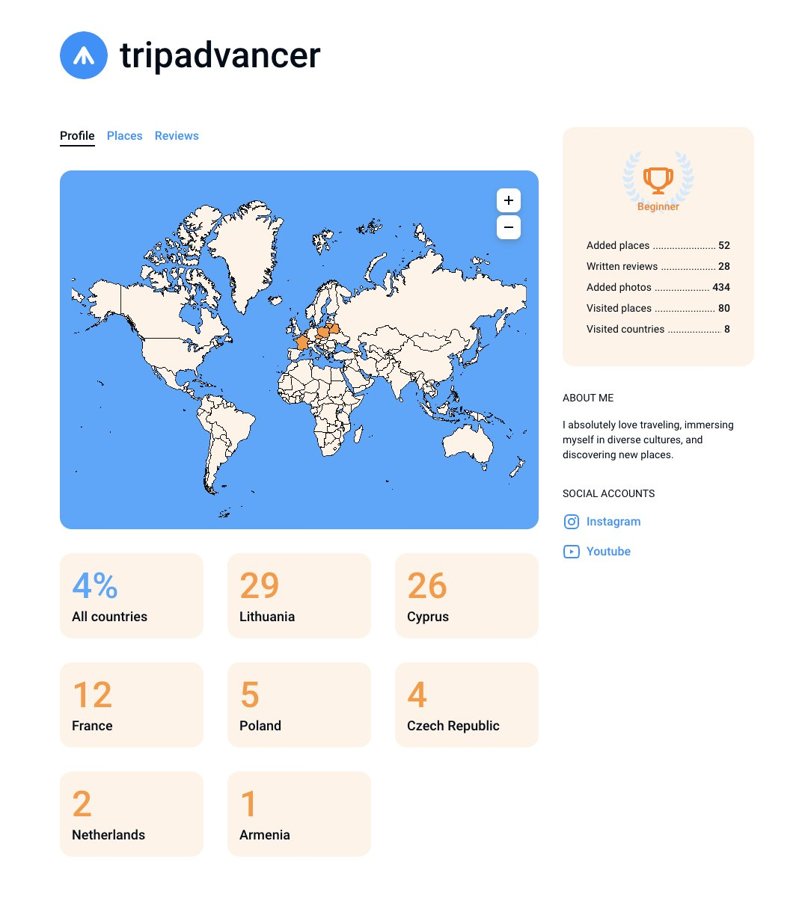

# User Map

In your profile, there's a mini world map where you can mark all the countries you've visited.

This map is visible to all users who visit your profile page. If you prefer to keep your visited countries private, you can hide them in the privacy settings.

To mark a country as visited, you need to mark at least one place in that country as visited. You can learn how to do this by clicking [here](/place/place-actions).

If the country you want to mark doesn't have a listed place you've visited, you can add it to the map and then mark it as visited. Learn more about adding a new place [here](/place/add-place).